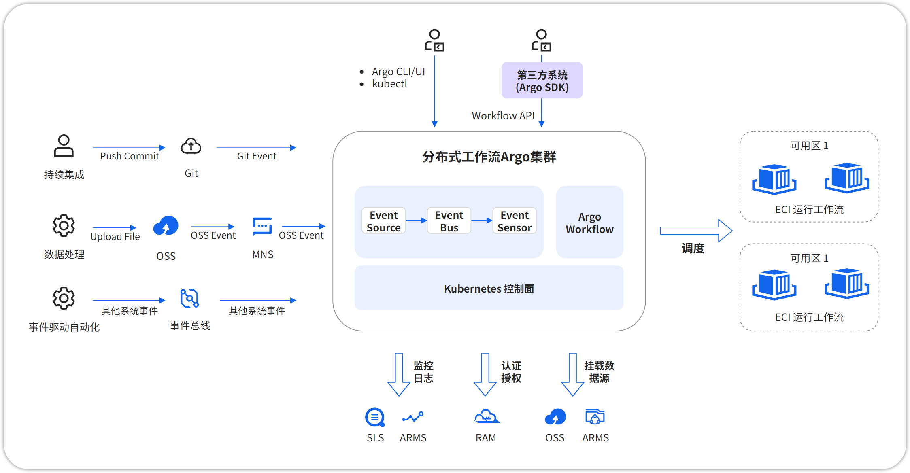
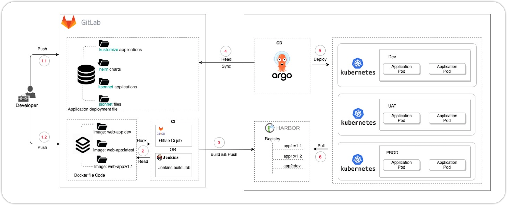

# Argo

# 简介

## 什么是 Argo？

Argo 是一套由 CNCF（云原生计算基金会）孵化并毕业的开源工具集，专为 Kubernetes 环境设计。它将复杂的云原生应用生命周期管理（从代码提交到生产部署，再到任务执行和发布）进行模块化、声明式和自动化，是实现 **GitOps** 和 **CI/CD** 最佳实践的核心支柱。

## 架构组成





Argo 有四大核心组件，分别用于不同场景：

* **Argo Workflows:** **基于容器的工作流引擎**。将多步骤、有依赖关系的批处理任务（如 CI/CD 构建、机器学习训练、数据处理）定义为可编排、可追踪、可重试的 Workflow。Argo Workflow 可以运行 10000 个并发工作流，每个工作流有 1000 个步骤，多用于机器学习、ETL、数据分析和处理管道、批处理、Serverless、CI/CD 等场景，已在 Adobe、阿里云、贝莱德、Capital One、Data Dog、Datastax、谷歌、GitHub、IBM、Intuit、NVIDIA、SAP、New Relic 和 RedHat 等超过 100 家知名企业的生产中应用。
* **Argo Events:** **事件驱动的自动化框架**。连接外部事件源（如 Github Webhook、S3 事件、Kafka 消息、定时器）与内部动作（如触发 Argo Workflow、调用 API），实现事件到响应的自动化流水线。
* **Argo CD: 基于 GitOps 的持续交付（CD）工具。**&#x6301;续监控 Git 仓库中的应用清单（manifests），并将 Kubernetes 集群的实际状态与仓库中的期望状态保持同步，实现自动化部署、回滚和自愈。
* **Argo Rollouts:** **渐进式交付控制器**。提供原生 Deployment 更高级的发布策略（如金丝雀 Cannary、蓝绿 Blue/Green、A/B 测试），支持基于指标（Prometheus）的自动分析和手动审批，降低发布风险。

## Argo 优势

* **声明式与 GitOps**：一切配置即代码（YAML），版本化、可审计、可复现。
* **Kubernetes 原生**：深度集成 K8s API，利用其强大的调度、资源管理、网络和安全模型。
* **模块化和可组合**：各组件可独立使用，也可无缝集成，构建复杂自动化流水线。
* **可观测性强**：提供直观的 Web UI 和丰富的指标（Prometheus），便于监控、调试和排障。
* **社区活跃与成熟**：CNCF 毕业项目，拥有庞大的企业用户和开发者社区，生态完善。
* **降低运维复杂度**：自动化部署、发布、任务执行，减少人为错误，提升效率。

# 环境准备与安装

## 前置条件

* **Kubernetes 集群**：v1.20+。推荐使用 kind(本地开发)、`k3d` 或云厂商托管集群 (EKS, GKE, AKS， ACK， CCE)。
* **kubectl**：已安装并配置好 kubeconfig。
* **Helm**（可选但推荐）：用于更灵活的安装配置。
* **Ingress Controller**（生产环境必需）：如 Nginx Ingress，Istio，Traefik，用于暴露服务。
* **外部存储**（可选）：为 Argo Workflows 的工件（Artifacts）准备 S3/MinIO 或 Artifactory。
* **DNS**（生产环境）：为 UI 和 API 配置域名。

## 安装 Argo Workflows

### 方法一：使用 Manifests（快速）

```shellscript
curl -o argo-workflows.yaml -L https://raw.githubusercontent.com/argoproj/argo-workflows/stable/manifests/install.yaml
sed -i -e 's#argoproj/#swr.cn-north-4.myhuaweicloud.com/ddn-k8s/quay.io/argoproj/#g' -e 's/v3.0.3/v3.6.10/g' argo-workflows.yaml
kubectl create namespace argo
kubectl apply -n argo -f argo-workflows.yaml
kubectl -n argo get pods
```

### 方法二：使用 Helm（推荐，生产环境）

```shellscript
helm repo add argo https://argoproj.github.io/argo-helm
helm repo update
tee argo-workflows-values.yaml <<-EOF
controller:
  image:
    tag: v3.6.10
  containerRuntimeExecutor: docker # 或 k8sapi, pns
server:
  image:
    tag: v3.6.10
  service:
    type: NodePort # 或 LoadBalancer, ClusterIP
  extraArgs:
    - --auth-mode=server # 启用服务器模式认证
  ingress:
    enabled: true
    hosts:
      - argo.example.com
    tls:
      - secretName: argo-tls
        hosts:
          - argo.example.com
ui:
  ingress:
    enabled: true
    hosts:
      - argo-ui.example.com
# 配置工件仓库 (S3 示例)
configs:
  artifactRepository:
    s3:
      bucket: argo-artifacts
      endpoint: s3.amazonaws.com
      region: us-west-2
      accessKeySecret:
        name: artifact-repo-secret
        key: accessKey
      secretKeySecret:
        name: artifact-repo-secret
        key: secretKey
EOF

# 安装
helm install argo-workflows argo/argo-workflows -n argo -f argo-workflows-values.yaml
```

### 安装 Argo CLI

```shellscript
cd /usr/local/src
sudo curl -LO https://ghproxy.net/https://github.com/argoproj/argo-workflows/releases/download/v3.6.10/argo-linux-amd64.gz
sudo gunzip argo-linux-amd64.gz
sudo mv argo-linux-amd64 /usr/local/bin/argo
sudo chmod +x /usr/local/bin/argo
argo version
```

## 安装 Arogo CD

### 方法一：使用 Manifests

```shellscript
curl -o argo-cd.yaml -L https://raw.githubusercontent.com/argoproj/argo-cd/stable/manifests/install.yaml
sed -i -e 's#quay.io/argoproj/#swr.cn-north-4.myhuaweicloud.com/ddn-k8s/quay.io/argoproj/#g' -e 's/v3.0.3/v3.6.10/g' argo-cd.yaml
sed -i 's#ghcr.io/dexidp/dex:v2.41.1#swr.cn-north-4.myhuaweicloud.com/ddn-k8s/ghcr.io/dexidp/dex:v2.43.1#g' argo-cd.yaml
sed -i 's#redis:7.2.7-alpine#swr.cn-north-4.myhuaweicloud.com/ddn-k8s/docker.io/library/redis:7.2.7-alpine#g' argo-cd.yaml
kubectl create namespace argocd
kubectl apply -n argocd -f argo-cd.yaml
# 暴露服务
kubectl patch svc argocd-server -n argocd -p '{"spec": {"type": "NodePort"}}'

ARGOCD_PASSWORD=$(kubectl -n argocd get secret argocd-initial-admin-secret -o jsonpath="{.data.password}" | base64 -d) && echo $ARGOCD_PASSWORD

```

### 方法二：使用 Helm(生产推荐)

```shellscript
helm repo add argo https://argoproj.github.io/argo-helm
helm repo update

cat > argocd-values.yaml <<EOF
configs:
  cm:
    # 启用 Dex (支持多种身份源)
    url: https://argocd.example.com
    dex.config: |
      connectors:
        - type: github
          id: github
          name: GitHub
          config:
            clientID: $GITHUB_CLIENT_ID
            clientSecret: $GITHUB_CLIENT_SECRET
            orgs:
            - name: your-org
  rbac:
    # 定义 RBAC 策略
    policy.csv: |
      p, role:admin, applications, *, */*, allow
      p, role:dev, applications, get, dev/*, allow
      p, role:dev, applications, sync, dev/*, allow
    policy.default: role:readonly
server:
  service:
    type: LoadBalancer
  ingress:
    enabled: true
    ingressClassName: nginx
    hosts:
      - argocd.example.com
    tls:
      - secretName: argocd-tls
        hosts:
          - argocd.example.com
  extraArgs:
    - --insecure # 仅在测试时使用，生产应配 TLS
repoServer:
  service:
    type: LoadBalancer # 如果仓库在集群外且网络受限
EOF

helm install argocd argo/argo-cd -n argocd -f argocd-values.yaml
```

### 安装 Argo CD CLI

```shellscript
cd /usr/local/src
sudo curl -LO https://gh-proxy.com/https://github.com/argoproj/argo-cd/releases/latest/download/argocd-linux-amd64
sudo mv argocd-linux-amd64 /usr/local/bin/argocd
sudo chmod +x /usr/local/bin/argocd
argocd version
```

# 安装 Argo Rollouts

```shellscript
```

#

#

# 参考文献

[Argo CD 使用指南 - KubeOperator 文档](https://kubeoperator.io/docs/user_manual/argocd/)
