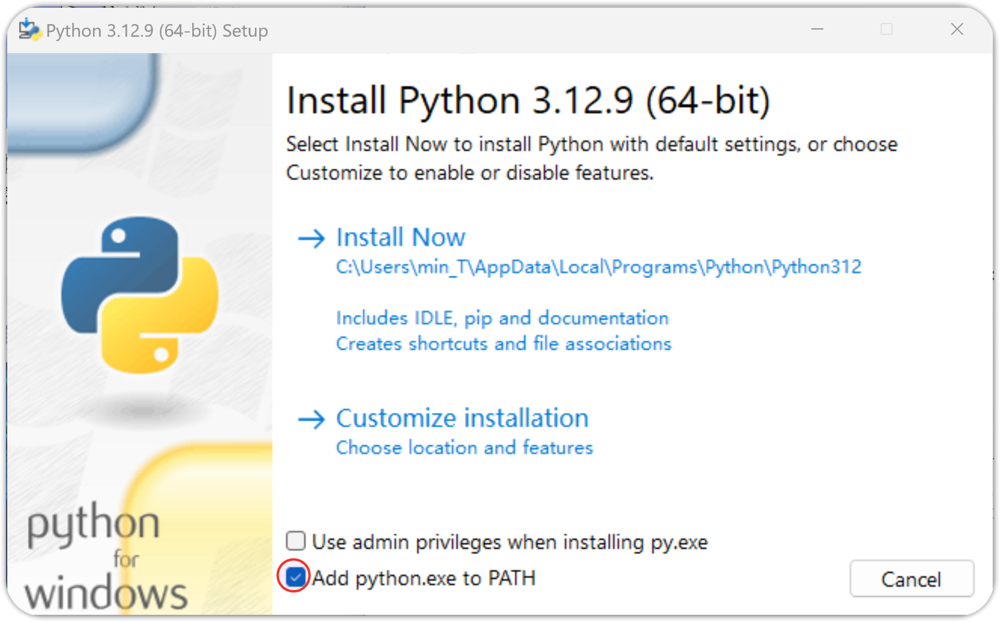
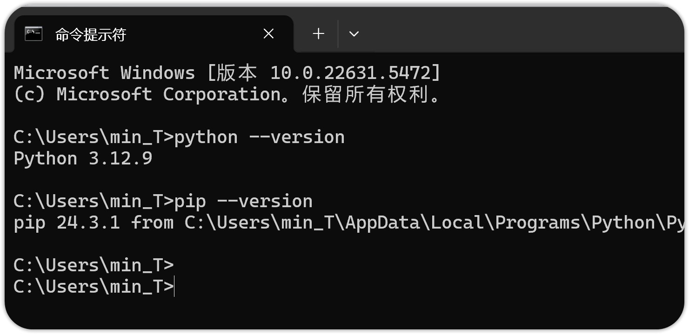
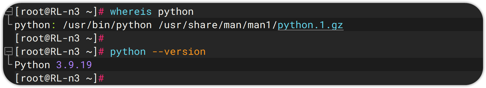
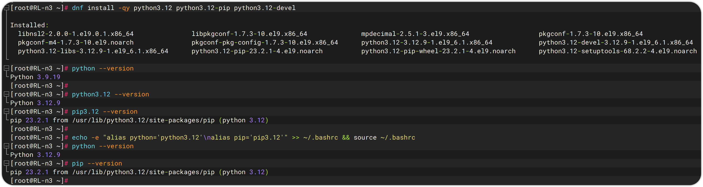
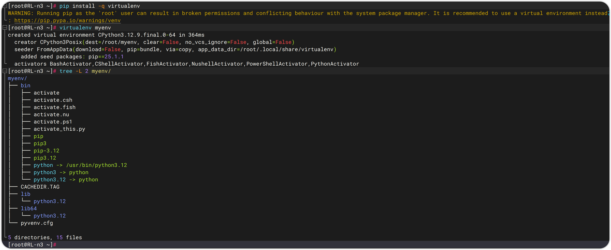
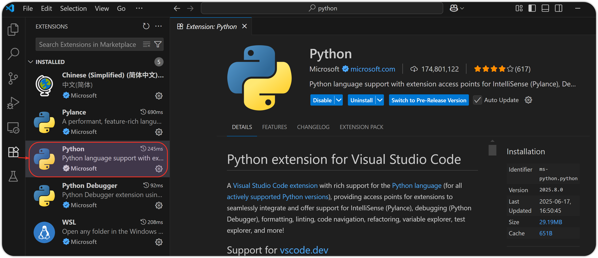
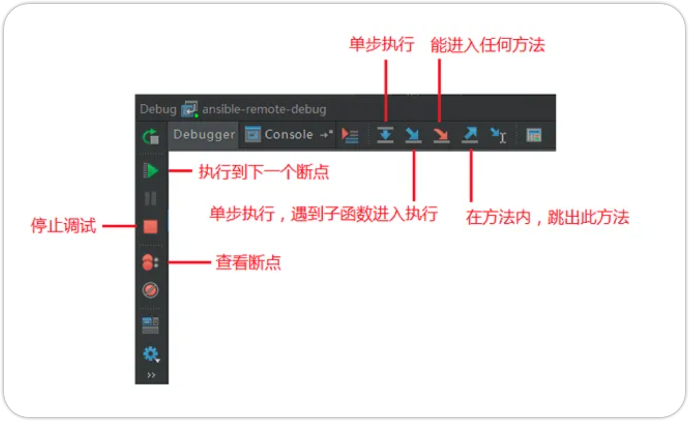
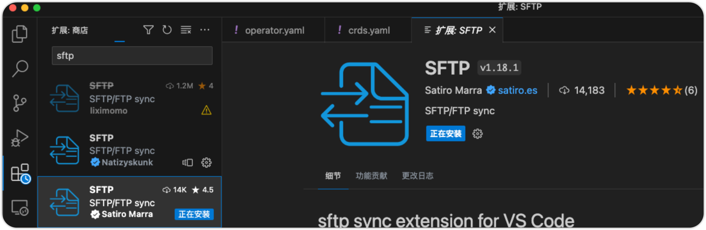
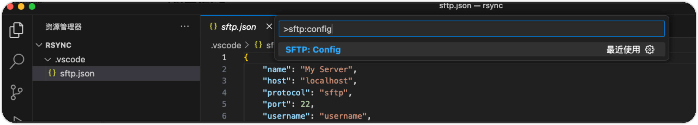
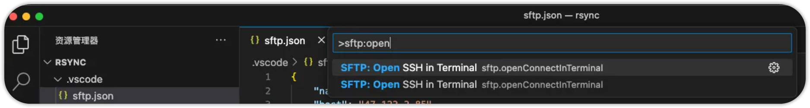

# 1 Python 简介与安装

# Python 简介

Python，一种高级解释型、动态类型的通用编程语言，Python，一种高级解释型、动态类型的通用编程语言，由荷兰程序员 Guido van Rossum 于 1991 年首次发布。Python 的设计哲学强调代码的可读性简洁性，使用缩进来定义代码块，避免了复杂的语法结构。

## Python 发展史

| **时间** | **事件**                            |
| ------ | --------------------------------- |
| 1989 年 | Guido van Rossum 开始开发 Python      |
| 1991 年 | 发布 Python 0.9.0（首个公开版本）           |
| 2000 年 | 发布 Python 2.0，引入垃圾回收机制            |
| 2008 年 | 发布 Python 3.0，不兼容 Python 2，优化语言设计 |
| 2020 年 | Python 2 正式停止维护，全面转向 Python 3     |
| 2025 年 | 当前主流版本为 Python 3.12/3.13，持续更新中    |

## Python 特点

| **特性**          | **描述**                                                                                           |
| --------------- | ------------------------------------------------------------------------------------------------ |
| **简单易学**        | 语法清晰，接近自然语言                                                                                      |
| **跨平台**         | 支持 Windows、macOS、Linux 等操作系统                                                                     |
| **可扩展性**        | 可与 C/C++ 结合，性能关键部分用 Cython 提升                                                                    |
| **丰富的标准库和第三方库** | 庞大的开源库和框架，如 Django、NumPy、Pandas、TensorFlow，涵盖 Web 开发、数据分析、AI、自动化等方向，广泛应用于科学计算、网站开发、自动化运维和人工智能等领域 |
| **多范式支持**       | 支持面向对象、函数式、过程式编程                                                                                 |
| **自动内存管理**      | 不需要手动分配或释放内存                                                                                     |
| **社区活跃**        | 拥有庞大的开发者社区和持续更新                                                                                  |

## Python 应用领域

| **领域** | **典型用途**       | **常用库/工具**                                   |
| ------ | -------------- | -------------------------------------------- |
| Web 开发 | 后端 API、网站开发    | Django、Flask、FastAPI                         |
| 数据分析   | 清洗、可视化、统计分析    | Pandas、NumPy、Matplotlib、Seaborn              |
| 人工智能   | 机器学习、深度学习、大模型  | Scikit-learn、TensorFlow、PyTorch、Transformers |
| 自动化脚本  | 文件处理、网络爬虫、系统任务 | Requests、BeautifulSoup、Selenium、os/shutil    |
| 科学计算   | 数值运算、图像处理、仿真建模 | SciPy、OpenCV、SymPy                           |
| 游戏开发   | 简单游戏制作         | Pygame                                       |
| GUI 应用 | 图形界面程序         | Tkinter、PyQt、Kivy                            |

# Windows 平台安装

[Python Releases for Windows | Python.org](https://www.python.org/downloads/windows/)

下载链接：https://www.python.org/ftp/python/3.12.9/python-3.12.9-amd64.exe





**❓ 如何安装多个 Python 版本？**

如果你需要多个 Python 版本共存，可以通过以下工具去管理：

https://github.com/pyenv-win/pyenv-win

# Linux 平台安装

1. 一般 Linux 发行版会自带 python，我们先检查下版本情况

   
2. 通常情况下，我们不建议直接升级系统 python 版本，因为它会影响到 dnf/yum 等工具，但我们可以通过更新 .bashrc 来修改我们默认使用的 python 版本

   

# Python 虚拟环境

虚拟环境 Virtual Environment 是 Python 提供的一种机制，用于为不同的项目创建的独立的、隔离的运行环境，每个虚拟环境都有自己的 Python 解释器、库和依赖包，避免不同项目之间的依赖冲突。

## 常见虚拟环境工具对比

| **工具**       | **内置/第三方**     | **特点**                        |
| ------------ | -------------- | ----------------------------- |
| `venv`       | Python 3.3+ 自带 | 官方推荐，轻量级，适合大多数用户              |
| `virtualenv` | 第三方            | 支持 Python 2 和更早版本，功能更灵活更强大    |
| `poetry`     | 第三方            | 包管理 + 虚拟环境 + 项目构建一体化工具        |
| `conda`      | 第三方（Anaconda）  | 不仅支持 Python，还支持 R、Node.js 等语言 |

结合前面我们提到的 pyenv 项目，通过 pyenv + virtualenv，我们基本就能做到企业级的多版本 Python 管理及虚拟环境创建。

## 使用自带的 venv 创建虚拟环境

```shellscript
python -m venv myenv       # 创建
source myenv/bin/activate  # 激活
deactivate                 # 退出
rm -rf myenv               # 删除
```


## 使用 virtualenv 创建虚拟环境

```shellscript
pip install -q virtualenv   # 安装
virtualenv --version

virtualenv myenv  # 创建，或 virtualenv -p /usr/bin/python3.10 myenv 指定 python 版本
source myenv/bin/activate  # 激活
deactivate                 # 退出
rm -rf myenv               # 删除
```



## 项目中推荐的虚拟环境使用方式

示例结构：

```
myproject/
├── .git/
├── src/
│   └── app.py
├── requirements.txt
├── README.md
└── myenv/        ← 虚拟环境（建议加入 .gitignore）
```

推荐在 .gitignore 中添加：

```
# Virtual environments
myenv/
__pycache__
*.pyc
*.log
.env
```

# IDE 使用 - VS Code

## 安装 Visual Studio Code

[Visual Studio Code - Code Editing. Redefined](https://code.visualstudio.com/)

## 安装 Python 语法支持插件



## 安装 JetBrains PyCharm

[PyCharm: The only Python IDE you need](https://www.jetbrains.com/zh-cn/pycharm/)

[🧰 一条命令，激活 JetBrains 全家桶，支持 Win、Linux、macOS，全平台激活就是这么简单！](https://mp.weixin.qq.com/s/hBI34n2cPLmXcCLt1KcleA)

> 本工具通过自动检测本机 `JetBrains` 产品，下载并配置 `ja-netfilter` 激活代理，注入启动参数（包括 `-javaagent` 和必要的 `--add-opens` 权限），并调用远程接口生成激活密钥，实现无需手动配置的全自动激活。

Windows Powershell：

```powershell
irm ckey.run | iex

# 加 debug 查看完整流程
irm ckey.run/debug | iex

# 仅查看源码，不执行
irm ckey.run
```

Linux/macOS Shell：

```shellscript
curl -L -o ckey.run ckey.run && bash ckey.run
```

## 使用 Pycharm 远程连接及管理 Docker

## Pycharm 的调试

## 使用 Pycharm 远程开发

## pycharm 调试



## 第三方库

PySnooper  打印函数内部执行信息，调试程序

## 常用插件

### 通用插件

1. CodeGlance Pro: 类似submit右侧代码缩略
2. Power Mode II: 打字特效插件
3. Translation: 翻译插件
4. .ignore: git忽略文件配置
5. .env files support: 配置文件支持
6. Json parse: json字符在线格式校验
7. ReST Console: 测试API接口

### pycharm 插件

1. Python smart execute

   选中测试部分代码，右键 execute，在控制台debug选中部分代码
2. Requirements

   检测pip库版本信息

### webstorm 插件

1. HighlightBracketPair: 高亮括号
2. IntelliVue: Vue功能增强
3. npm-dependency-checker: 检测包版本信息

## vscode 同步文件到服务器

### 安装插件



### 配置同步

打开命令面板，搜索配置项：



修改 sftp 配置文件：

```json
{
    "name": "XXX服务器",
    "host": "XXXXXX",
    "protocol": "sftp",
    "port": XXX,
    "username": "root",
    "password": "XXX",
    "privateKeyPath": "C:/Users/cuiliang/.ssh/id_rsa", // 密码和密钥二选一
    "remotePath": "/root/rsync",
    "uploadOnSave": true,
    "useTempFile": false,
    "openSsh": false,
    "ignore": [
        ".vscode",
        ".git",
        ".DS_Store"
    ],
    "watcher": {
        "files": "**/*",
        "autoUpload": true,
        "autoDelete": true
    }
}
```

打开命令面板，连接服务器：




# IDE 使用 -PyCharm
