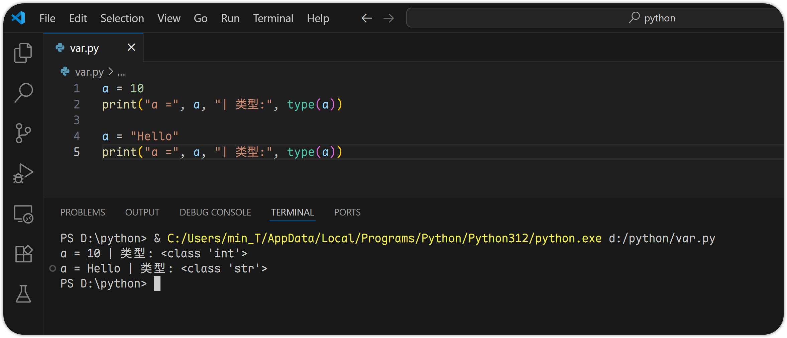
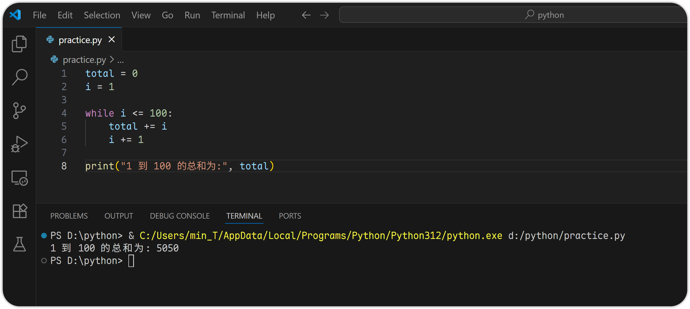

# 2 Python 基础语法

# 变量与基本数据类型

## 变量（Variables）

**变量定义方式**：

```python
x = 5
name = "ZhangSan"
```

* 无需声明类型，Python 是一种动态类型语言（Dynamically Typed Language）
* 变量名可以包含字母、数字、下划线\_，但不能以数字开头
* 变量名、=、变量值之间以空格分隔
* 推荐使用小写命名法（如 user\_name）

## 基本数据类型（Primitive Data Types）

Python 中最常见的四种基本数据类型是：

| **类型**  | **示例**                            | **描述**        |
| ------- | --------------------------------- | ------------- |
| `int`   | `5`,`-3`,`1000`                   | 整数            |
| `float` | `3.14`,`-0.001`,`2e5`             | 浮点数（小数或科学计数法） |
| `bool`  | `True`,`False`                    | 布尔值（只有两个取值）   |
| `str`   | `"Hello"`,`'World'`,`"""多行字符串"""` | 字符串           |

让我们来用 Python 来演示这些类型的变量：

```python
# 整型 int
x = 10
print("x =", x, "| 类型:", type(x))

# 浮点型 float
y = 3.1415
print("y =", y, "| 类型:", type(y))

# 布尔值 bool
is_valid = True
print("is_valid =", is_valid, "| 类型:", type(is_valid))

# 字符串 str
message = "Hello, Python!"
print("message =", message, "| 类型:", type(message))
```


## 动态类型特性（Dynamic Typing）

Python 是动态类型语言，意味着变量的类型是在运行时自动推断的，并且可以随时改变。

示例：

```python
a = 10
print("a =", a, "| 类型:", type(a))

a = "Hello"
print("a =", a, "| 类型:", type(a))
```



## 类型转换（Type Casting）

有时我们需要将一种类型转换为另一种，Python 为此提供了一些内置函数来实现：

**常见类型转换函数：**

| **函数**    | **说明** | **示例**                 |
| --------- | ------ | ---------------------- |
| `int()`   | 转换为整型  | `int("123")`→`123`     |
| `float()` | 转换为浮点型 | `float("3.14")`→`3.14` |
| `str()`   | 转换为字符串 | `str(42)`→`"42"`       |
| `bool()`  | 转换为布尔值 | `bool(0)`→`False`      |

```python
# 字符串转整数
num_str = "123"
num_int = int(num_str)
print("num_int =", num_int, "| 类型:", type(num_int))

# 整数转字符串
num_str2 = str(456)
print("num_int =", num_str2, "| 类型:", type(num_str2))

# 浮点型转整数（会截断）
float_num = 3.9
int_num = int(float_num)
print("int_num =", int_num, "| 类型:", type(int_num))

# 整数转布尔, 0/1 又被称为布尔值
value = bool(0)
value2 = bool(1)
print("value =", value, "| value2 =", value2)
```


**类型转换失败示例：**


可以使用 try-except 来处理可能失败的类型转换：

```python
# 使用 try-except 来处理可能失败的类型转换 - 转换成功时
try:
    num = int("123")
    print("num =", num, "| 类型:", type(num))
except ValueError:
    print("转换失败: 输入不是有效的整数")

# 使用 try-except 来处理可能失败的类型转换 - 转换失败时
try:
    num = int("123a")
    print("num =", num, "| 类型:", type(num))
except ValueError:
    print("转换失败: 输入不是有效的整数")
```


## 实战练习

```python
# 将字符串 "3.1415" 转换为浮点数并打印
num_str = "3.1415"
num_float = float(num_str)
print(num_float)

# 将整数 789 转换为字符串，并与 "abc" 拼接后打印
int_num = 789
result = str(int_num) + "abc"
print(result)

# 通过打印来判断以下表达式的布尔值
print(bool(0))
print(bool(1))
print(bool("Flase"))
print(bool("True"))
print(bool(""))
print(bool(None))
```


# 运算符

## 算术运算符

| **运算符** | **含义** | **示例**   | **结果** |
| ------- | ------ | -------- | ------ |
| `+`     | 加法     | `3 + 2`  | `5`    |
| `-`     | 减法     | `5 - 2`  | `3`    |
| `*`     | 乘法     | `4 * 3`  | `12`   |
| `/`     | 浮点除法   | `7 / 2`  | `3.5`  |
| `//`    | 整数除法   | `7 // 2` | `3`    |
| `%`     | 取余     | `7 % 2`  | `1`    |
| `**`    | 幂运算    | `2 ** 3` | `8`    |

示例：

```python
print(3 + 2)
print(0 - 1)
print(9 * 3)
print(10 / 3)
print(10 // 3)
print(10 % 3)
print(2 ** 5)
```


## 比较运算符（返回布尔值）

| **运算符** | **含义** | **示例**   | **结果** |
| ------- | ------ | -------- | ------ |
| `==`    | 等于     | `3 == 3` | `True` |
| `!=`    | 不等于    | `3 != 4` | `True` |
| `>`     | 大于     | `5 > 3`  | `True` |
| `<`     | 小于     | `2 < 4`  | `True` |
| `>=`    | 大于等于   | `4 >= 4` | `True` |
| `<=`    | 小于等于   | `3 <= 5` | `True` |

示例：

```python
print(3 == 3)
print(0 != (3 == 3))
print(-1 > 1)
print(-1 < 0)
print(0 >= -1)
print(0 <= (2 % 2))
```


## 逻辑运算符（用于组合布尔表达式）

| **运算符** | **含义** | **示例**           | **结果**  |
| ------- | ------ | ---------------- | ------- |
| `and`   | 与      | `True and False` | `False` |
| `or`    | 或      | `True or False`  | `True`  |
| `not`   | 非      | `not (3 > 2)`    | `False` |

示例：

```python
print(True and False)
print((0 >= -1) or (-1 > 1))
print(not (0 != 1))
```


## 成员运算符（用于判断元素是否在序列中）

| **运算符**  | **含义**    | **示例**             | **结果** |
| -------- | --------- | ------------------ | ------ |
| `in`     | 是否存在于序列中  | `'a' in 'abc'`     | `True` |
| `not in` | 是否不存在于序列中 | `'x' not in 'abc'` | `True` |

示例：

```python
print('a' in 'abc')
print('2' not in '234')
print(3 in [1, 2, 3])
print(3 not in [1, 2, 3.1415])
```


## 实战练习

1. 计算 2×3 + 4^2 的值
   ```python
   result = 2 * 3 + 4 ** 2
   print(
   ```
   
2. 判断表达式 (2 > 3) and ('b' in 'apple') or (0 != True)
   ```python
   result1 = (2 > 3) and ('b' in 'apple') or (0 != True)
   print(result1)
   ```
   

# 控制流

## 条件语句 if

用于根据不同条件执行不同的代码块。

**基本语法：**

```python
if 条件1:
    # 条件1为True时执行的代码
elif 条件2:
    # 条件2为True时执行的代码
else
    # 所有条件都不为True时执行的代码
```

可以很明显地看到，与其他语言如 shell 等不同的是，Python 中的 if 语句并不需要 fi 的结束标识，这是因为 Python 依靠 `:` 和 `缩进` 来判断代码块。

示例：

```python
try: 
    num = int(input("请输入一个整数: "))
    if num > 0:
        print("这是正数")
    elif num < 0:
        print("这是负数")
    else:
        print("这是零")
except ValueError:
    print("输入的数不是一个整数!")
```


## 循环语句 for

用于遍历可迭代对象，如范围、列表、元组、字符串、字典等。

### 遍历范围 range()

`range(start, end)` 表示从 `start` 到 `end - 1` 的数字序列。

```python
for i in range(2, 8):
    print(i)
```


### 遍历列表 \[]

```python
system_os = ["windows", "macOS", "linux", "android"]
for os in system_os:
    print(os)
```


### 遍历字典 {"":"", "":"", "":""}

遍历字典时，默认遍历的是键（key），也可以使用 `.items()` 同时获取键和值。

```python
person = {"name": "lisi", "age": 29, "city": "Beijing"}

# 方式 1: 通过 xx[key] 访问获取值
for key in person:
    print(f"{key}: {person[key]}")

print("---------")

# 方式 2: 通过 xx.items() 获取键值对
for key, value in person.items():
    print(f"{key}: {value}")
```


`print(f"string")` 是格式化字符串的用法，它允许你在字符串中嵌入变量或表达式，并将它们的值动态插入字符串，相当于 shell 中的 echo `-e` 选项。

## 循环语句 while

在某个条件为真时，重复执行一段代码。

**基本语法：**

```python
while 条件:
    # 条件为 True 时执行的代码
```

示例：

```python
total = 0
i = 1

while i <= 100:
    total += i
    i += 1

print("1 到 100 的总和为:", total)
```



## 子句 break/continue/else

这些关键字用于控制循环流程。

### break: 提前退出循环

```python
for num in range(1, 10):
    if num == 5:
        break
    print(num)
```


### continue: 跳过当前循环，继续下一次

```python
for num in range(1, 10):
    if num % 2 == 0:
        continue
    print(num)
```


### else: 循环正常结束后执行

```python
for num in range(3):
    print(num)
else:
    print("循环结束")
```


## 实战练习

1. 使用 if-elif-else 判断一个年份是否是闰年

   分析：能被 4 整除但不能被 100 整除，或能被 400 整除 → 是闰年。
   ```python
   try:
       year = int(input("请输入一个年份: "))

       if year % 4 == 0 and year % 100 != 0:
           print(f"{year} 是闰年")
       elif year % 400 == 0:
           print(f"{year} 是闰年")
       else:
           print(f"{year} 不是闰年")
   except ValueError:
       print("输入的不是一个整数!")
   ```
   
2. 使用 while 实现一个简单的猜数字游戏
   ```python
   secret_num = 78
   print("猜数字游戏: 我已经想好了一个 1 ~ 100 的数字, 请猜猜它是多少。")

   while True:
       guess = int(input("请输入你的猜测: "))

       if guess < secret_num:
           print("猜小了, 再试一次!")
       elif guess > secret_num:
           print("猜大了, 再试一次!")
       else:
           print("恭喜你, 猜对了！")
           break
   ```
   
3. 一个简单的控制台计算器
   ```python
   print("******* 欢迎使用简单计算器 *******")
   print("请选择操作:")
   print("1:加法  2:减法  3:乘法  4:除法")

   choice = input("请输入你的选择 (1/2/3/4): ")

   if choice in ['1', '2', '3', '4']:
       num1 = int(input("请输入第一个数: "))
       num2 = int(input("请输入第二个数: "))

       if choice == '1':
           print(f"结果是: {num1} + {num2} = {num1 + num2}")
       elif choice == '2':
           print(f"结果是: {num1} - {num2} = {num1 - num2}")
       elif choice == '3':
           print(f"结果是: {num1} * {num2} = {num1 * num2}")
       elif choice == '4':
           if num2 != 0:
               print(f"结果是: {num1} / {num2} = {num1 / num2}")
           else:
               print("错误: 除数不能是 0!")
   else:
       print("请输入你的选项不正确, 请重新运行程序并输入 1 ~ 4 中的一个数字。")
   ```
   
4. 使用 for 循环打印九九乘法表
   ```python
   for i in range(1, 10):
       for j in range(1, i + 1):
           print(f"{j}*{i}={j*i}", end="\t")
       print()  # 换行
   ```
   

