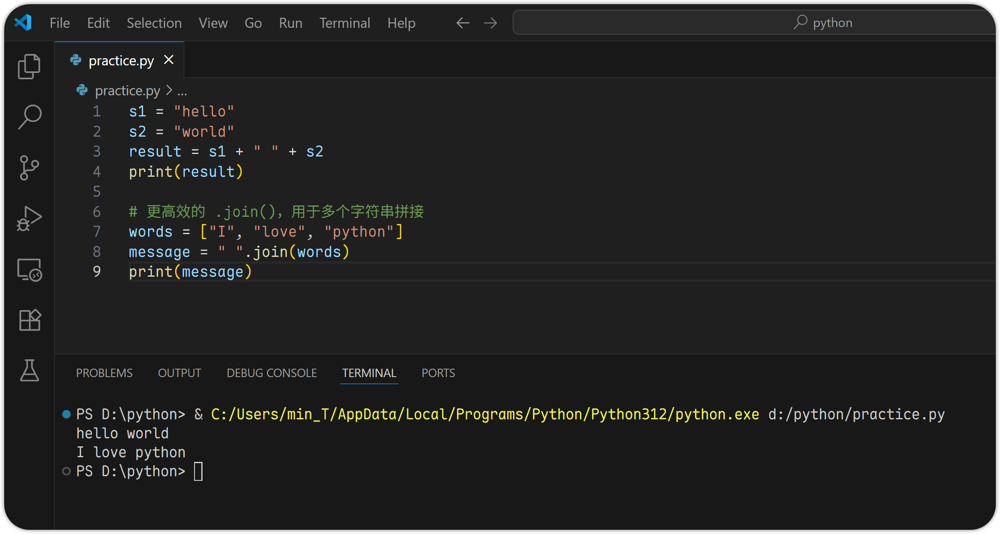
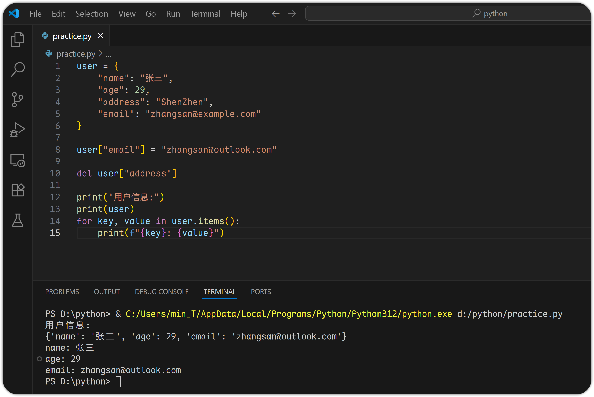

# 3 Python 数据结构

# 字符串 string

## 字符串格式化

### f-string（推荐使用）

Python 3.6+ 支持，语法简洁直观。

```python
name = "张三"
age = 29
print(f"我的名字是 {name}, 今年 {age} 岁。")
```


### .format() 方法

适用于老版本 Python，或需要更灵活控制格式的情况。

```python
name = "张三"
age = 29
print("我的名字是 {}, 今年 {} 岁。".format(name, age))
```


我们可以看到，.formar() 类似于我们在其他语言中知名的 printf() 函数，都依赖于占位符。

## 字符串基本操作

### 切片

```python
s = "hello world"

print(s[0])
print(s[0:4])
print(s[:5])
print(s[-5:])
print(s[6:11])
```


我们可以看出，python 的字符串切片遵循的是：

* 从索引 `0` 开始计算
* 左闭右开：`start` 索引处的字符会被包含在结果中，`end` 索引处的字符不会被包含在结果中。

### 查找 .find("")

* `in` 判断子串是否存在
* `.find()` 返回第一次出现的位置，若不存在则返回 `-1`
* `.index()` 与 `.find()` 类似，但找不到不会报错

```python
s = "hello world"

print("world" in s)
print(s.find("o"))
print(s.find("z"))
print(s.index("o"))
print(s.index("z"))
```


### 替换 .replace("", "")

```python
s = "hello world"
new_s = s.replace("world", "python")
print(new_s)
```


### 拼接 + 或 .join()

```python
s1 = "hello"
s2 = "world"
result = s1 + " " + s2
print(result)

# 更高效的 .join()，用于多个字符串拼接
words = ["I", "love", "python"]
message = " ".join(words)
print(message)
```



## 正则表达式 re 模块基础

正则表达式是一种强大的文本匹配工具，python 中通过 `re` 模块来具体实现，使用前需先使用 `import` 导入模块。

### re.match(): 从开头匹配

```python
import re

text = "hello123"
# 定义正则表达式模式 r"\w+"
# r 表示使用原始字符串，避免转义
# \w 匹配任意字母、数字、下划线, 等效于 [a-zA-Z0-9_]
# + 表示匹配前面 \w 的字符一次或多次
pattern = r"\w+"

# re.match() 函数, 用于从字符串的起始位置开始匹配正则表达式, 成功就返回一个匹配对象, 没成功就返回 None
match = re.match(pattern, text)
if match:
    # match.group(), 匹配对象的方法，用于获取匹配到的字符串内容
    print("匹配成功: ", match.group())
```


### re.search(): 在整个字符串中搜索

```python
import re

text = "hello123"
match = re.search(r"\d+", text)
if match:
    print("找到数字:", match.group())
```


### re.findall(): 找出所有匹配项

```python
import re

text = "Zhangsan is 22, Lisi is 18, Wanger is 30."
ages = re.findall(r"\d+", text)  # re.findall() 函数返回的是一个包含所有匹配项的数组
if ages:
    print(ages)
```


### re.sub(): 替换匹配内容

```python
import re

text = "Zhangsan is 22, Lisi is 18, Wanger is 30."
new_text = re.sub(r"\d+", "18", text)
print(new_text)
```


# 列表 list

## 概念与基本操作

列表 list 是 Python 中最常用的数据结构之一，它是一个有序、可变、可重复的集合。

```python
# 创建列表
fruits = ["apple", "banana", "cherry"]
numbers = [1, 3, 5, 7, 9]
mixed = ["hello", 29, True, 3.14]
empty_list = []

# 访问元素: 直接索引 或 切片
print(fruits[-1])
print(numbers[2:])
print(mixed[-2:])
print()

# 修改元素
fruits[-1] = "bluecherry"
print(fruits)
print(empty_list)
print()

# 删除元素: del 或 .remove()
fruits.remove("bluecherry")
del fruits[-1]

# 访问元素: 直接索引 或 切片
print(fruits[-1])
```


## 常用方法

| **方法**          | **功能**                |
| --------------- | --------------------- |
| `.append(x)`    | 在末尾添加一个元素             |
| `.insert(i, x)` | 在指定位置 `i` 处插入一个元素 `x` |
| `.remove(x)`    | 删除第一个值为 `x` 的元素       |
| `.sort()`       | 对列表进行排序               |
| `.reverse()`    | 反转列表                  |

```python
my_list = [2, 3, 1, 5, 4]

my_list.append(6)
print(my_list)

my_list.insert(1, 10)
print(my_list)

my_list.remove(3)
print(my_list)

my_list.sort()
print(my_list)

my_list.reverse()
print(my_list)
```


## 列表推导式

列表推导是一种简洁创建列表的方式。

**语法格式：**

```python
[表达式 for 变量 in 可迭代对象]
```

示例：

```python
squares = [x**2 for x in range(10)]
print(squares)

even_squares = [x**2 for x in range(10) if x % 2 == 0]
print(even_squares)
```


## 多维列表

列表中还可以包含其他列表：

示例：

```python
matrix = [
    [1, 2, 3],
    [4, 5, 6],
    [7, 8, 9]
]

print(matrix[1][2])
```


## 实战练习

1. 过滤无效数据

   要求：有一个包含字符串和数字的列表，只保留其中的整数，并输出他们的平均值。
   ```python
   data = [10, "hello", 20, None, 30, True, 40, False]

   integers = [x for x in data if isinstance(x, int) and not isinstance(x, bool)]

   if integers:
       average = sum(integers) / len(integers)
   else:
       average = 0

   print("有效整数:", integers)
   print("平均值为:", average)
   ```
   

   应用场景：在后端接口接收数据时，可能收到混合类型的数据，需要清洗后再进行计算。
2. 查找重复项

   要求：找出列表中所有重复出现的元素，并返回这些元素组成的列表。
   ```python
   nums = [1, 2, 3, 4, 5, 6, 7, 8, 9, 1, 3]
   seen = []
   duplicates = []

   for num in nums:
       if num in seen and num not in duplicates:
           duplicates.append(num)
       elif num not in seen:
           seen.append(num)

   print("重复的元素有:", duplicates)
   ```
   
   > 注意：这个写法最后的输出顺序不一定与原始出现顺序一致，如果需要保持顺序一致或更高效处理，可以后面学完 `字典` 或 `集合` 后再优化。
3. 合并多个列表并去重与排序

   要求：给定多个列表，合并成一个新列表，并去除重复项后按升序排列。
   ```python
   list1 = [1, 2, 3, 4]
   list2 = [3, 4, 5, 6]
   list3 = [5, 6, 7, 8]

   combined = list1 + list2 + list3

   # 去重（思路: 逐个检查）
   unique = []
   for num in combined:
       if num not in unique:
           unique.append(num)

   # 排序（思路: 冒泡排序。 当然也可以直接使用 sorted()）
   for i in range(len(unique)):
       for j in range(i + 1, len(unique)):
           if unique[i] > unique[j]:
               unique[i], unique[j] = unique[j], unique[i]

   print("合并后的唯一有序列表:", unique)
   ```
   
4. 模拟分页功能

   要求：实现一个“分页”逻辑，接受一个列表和每页大小，返回指定页码对应的数据子集。
   ```python
   data = list(range(1, 121))
   page_size = 5
   page_number = int(input("请输入页码(1/2/3/...): "))

   start_index = (page_number - 1) * page_size
   end_index = start_index + page_size

   page_data = data[start_index:end_index]

   print(f"第 {page_number} 页的内容是:", page_data)
   ```
   
5. 统计词频（使用列表）

   要求：给定一段英文文本，统计每个单词出现的次数（忽略大小写）
   ```python
   text = "Apple is great, but Google is better. Apple and Google are both great!"

   # 清洗文本（暂不使用 re 正则表达式模块）
   cleaned_text = text.lower().replace(",", "").replace(".", "").replace("!", "")

   words = cleaned_text.split()

   word_list = []
   count_list = []

   for word in words:
       if word in word_list:
           index = word_list.index(word)
           count_list[index] += 1
       else:
           word_list.append(word)
           count_list.append(1)

   print("词频统计:")
   for i in range(len(word_list)):
       print(f"{word_list[i]} \t出现了 {count_list[i]} 次")
   ```
   

# 元组 tuple

## 概念与基本操作

元组是 Python 中的一种有序、不可变的数据结构，用于存储多个元素。它和列表非常相似，但一旦创建就不能修改。

```python
# 创建元组
point = (3, 5)
names = ("Alice", "Blob", "Charlie")
single_tuple = (42,)  # 单个元素的元组必须有逗号，否则就是普通变量
empty_tunple = ()

# 访问元组元素
print(names[0])
print(names[0:2])
print(empty_tunple)

# 不可变性（Immutable）: 不可修改、添加、删除
point[1] = 4
```


## 元组的常见用途

### 元组 vs 列表

| **特点** | **列表（list）** | **元组（tuple）** |
| ------ | ------------ | ------------- |
| 是否可变   | ✅ 可以修改       | ❌ 不可修改        |
| 使用符号   | `[]`         | `()`          |
| 性能     | 插入/修改较慢      | 更快（适合只读数据）    |
| 适用场景   | 需要频繁修改的数据    | 数据保护、函数返回值等   |

### 函数返回多个值（最常用场景）

Python 函数可以返回多个返回值，其实底层是返回了一个元组。

```python
def get_coordinates():
    x = 10
    y = 20
    return x, y

result = get_coordinates()
print(result)
print(result[1])

x, y = get_coordinates()
print("x =", x, "\t", "y =", y)
```


### 作为字典的键

只有不可变类型才能做字典的键。

```python
locations = {
    (40.7128, -74.0060): "New York",
    (34.0522, -118.2437): "Los Angeles"
}

print(locations[(40.7128, -74.0060)])
```


### 数据保护

当你希望防止某些数据被意外修改时，可以使用元组来保存。

```python
month = ("January", "February", "March", ..., "December")
```

## 元组的操作

虽然元组不可变，但支持一些不改变原元组的操作。

### 拼接元组

```python
a = (1, 2)
b = ("hello", 3)
c = a + b

print(c)
```


### 重复元组

```python
t = (1, 2) * 3

print(t)
```


### 成员判断

```python
t = (1, 2)

print(2 in t)
print(0 in t)
```


### 获取长度、最大/最小值/求和

```python
nums = (5, 1, 9, 3)

print("长度\t: ", len(nums))
print("最大值\t: ", max(nums))
print("最小值\t: ", min(nums))
print("总和\t: ", sum(nums))
```


# 字典 dict

## 概念与基础操作

字典是 Python 中一种非常重要的数据结构，它是一个无序的键值对集合，每个键对应一个值，类似于生活中的“查字典”。

```python
# 创建字典: 使用 {} 或 dict()
person = {"name": "Zhangsan", "age": 25, "city": "Beijing"}
person2 = dict(name="Lisi", age=30, city="Shanghai")
empty_dict = {}

# 访问字典中的值
print(person)
print(person2["name"])
print(person2.get("name"))
# print(person2["tel"])  # 获取不存在的键会报错, 故此时可以使用 .get()
print(person2.get("tel"))

# 添加或更新键的值
person["name"] = "Wanger"
person["tel"] = "19924567842"
print(len(person))
print(person)

# 删除指定键值对：使用 del 或 .pop() -- 能获取被删除的键的值
del person["city"]
gender = person.pop("age")
print(gender)
```


## 遍历字典

```python
person = {"name": "Zhangsan", "age": 25, "city": "Beijing"}

# 遍历 key
for k in person:
    print(k)
print("------")

# 遍历 value
for v in person.values():
    print(v)
print("------")

# 遍历 key:value
for k, v in person.items():
    print(f"{k}: {v}")
```


## 字典推导式

类似于列表推导式，但生成的是字典。

**语法：**

```python
{key表达式: value表达式 for 元素 in 可迭代对象}
```

示例 1：将列表转换为字典

```python
words = ["apple", "banana", "cherry"]
word_dict = {word: len(word) for word in words}

print(word_dict)
```


实例 2：筛选偶数作为键，平方作为值

```python
squars = {x: x**2 for x in range(10) if x % 2 == 0}
print(squars)
```


## 实战练习

1. 用户信息存储

   场景：模拟一个系统中保存用户基本信息的场景，比如姓名、年龄、邮箱等字段。
   ```python
   user = {
       "name": "张三",
       "age": 29,
       "address": "ShenZhen",
       "email": "zhangsan@example.com"
   }

   user["email"] = "zhangsan@outlook.com"

   del user["address"]

   print("用户信息:")
   print(user)
   for key, value in user.items():
       print(f"{key}: {value}")
   ```
   
2. API 接口数据交换

   场景：后端 API 返回的数据通常是 JSON 格式，本质上是 Python 的字典或列表嵌套结构。假设你收到如下 API 数据，需要从中提取出所有订单编号和总金额。
   ```python
   api_resource = {
       "status": "success",
       "data": [
           {"order_id": "A001", "amount": 150},
           {"order_id": "A002", "amount": 300},
           {"order_id": "A003", "amount": 200}
       ]
   }

   total_amount = 0

   if api_resource["status"] == "success":
       for order in api_resource["data"]:
           print(f"订单编号: {order['order_id']}, 金额: {order['amount']}")
           total_amount += order["amount"]

   print(f"总金额: {total_amount}")
   ```
   
3. 配置管理（高级）

   场景：在企业项目中，通常会用字典来保存配置参数，如数据库连接信息、日志路径、API 密钥等。
   ```python
   import pprint
   # ppint(): Python 的一个内置模块，全称为 “pretty-print”，即“漂亮打印”，用于以更易读的格式打印复杂的数据结构，如嵌套的字典、列表等
   config = {
       "database": {
           "host": "localhost",
           "port": 3306,
           "username": "admin",
           "password": "AAAaaa12#$"
       },
       "logging": {
           "level": "INFO",
           "file_path": "/var/log/app.log"
       }
   }

   # 添加
   config["environment"] = "development"
   # 修改
   config["logging"]["level"] = "DEBUG"
   # 打印
   print(f"数据库地址: {config['database']['host']}:{config['database']['port']}")
   print(config)
   pprint.pprint(config)  
   ```
   
4. 缓存机制（企业级）

   场景：在 web 应用中，为提高性能，常使用字典实现简单的缓存功能，避免重复计算或请求外部接口。

   示例：模拟一个“商品价格查询”功能，使用字典作为缓存，避免每次都调用数据库或请求外部接口。
   ```python
   cache = {}

   def get_price(product_id):
       if product_id in cache:
           print(f"[缓存] 商品 {product_id} 的价格是: {cache[product_id]}")
       else:
           # 模拟从数据库获取价格
           price = (product_id * 10) % 100 + 50
           cache[product_id] = price
           print(f"[数据库] 商品 {product_id} 的价格是: {price}")

   get_price(101)
   get_price(124)
   get_price(132)
   get_price(101)
   get_price(167)
   get_price(124)
   ```
   

# 集合 set

## 概念与基础操作

集合是一个无序、不重复元素的容器。常用于：

* 快速去重
* 集合运算（如交集、并集、差集）
* 成员判断（比列表更快）

```python
# 创建集合: 使用 {} 或 set()
s1 = {1, 2, 3}
s2 = set([2, 3, 2, 4])  # 将列表转成集合后自动去重
empty_set = set()  # 注意: 空集合则不能使用 {}，因为会和空字典 {} 混淆

# 添加元素
s1.add(4)

# 删除元素: remove()、discard() -- 若不存在也不会报错
s1.remove(2)
s1.discard(2)

# 打印元素
print(s1)
print(s2)

# 清空集合
s1.clear()
print(s1)
```


## 集合运算（最常用场景）

集合支持数学中的集合运算，非常适合企业开发中对数据进行分类、筛选、比较等操作。

| **运算** | **方法**                    | **符号** | **含义**             |
| ------ | ------------------------- | ------ | ------------------ |
| 并集     | `.union()`                | \`     | 两个集合相并的元素          |
| 交集     | `.intersection()`         | `&`    | 同时出现在两个集合中的元素      |
| 差集     | `.difference()`           | `-`    | 在第一个集合但不在第二个集合中的元素 |
| 对称差集   | `.symmetric_difference()` | `^`    | 只在其中一个集合中出现的元素     |

```python
a = {1, 2, 3}
b = {2, 3, 4}

print(a.union(b))
print(a.intersection(b))
print(a.difference(b))
print(a.symmetric_difference(b))
```


## 不可变集合 frozenset

如果你希望一个集合不能被修改，可以使用 frozenset。

```python
fs = frozenset([1, 2, 3])

fs.add(4)
```


## 实战练习

1. 多用户权限管理系统

   场景：一个企业后台系统有多个角色和权限，每个用户属于一个或多个角色，每个角色包含若干权限，你需要找出某个用户的所有有效权限。
   ```python
   # 给定数据结构
   roles = {
       "admin": {"create", "read", "update", "delete"},
       "editor": {"read", "update"},
       "viewer": {"read"},
       "developer": {"create", "read", "debug"}
   }

   user_roles = {
       # 角色的顺序可能有意义，为保留添加顺序因此使用 list 而非 set
       "Alice": ["admin"],
       "Bob": ["editor", "viewer"],
       "Charlie": ["viewer", "developer"]
   }

   # 计算每个用户的总权限
   user_permissions = {}

   for user, role_list in user_roles.items():
       permissons = set()
       for role in role_list:
           permissons.update(roles[role])
       user_permissions[user] = permissons

   # 打印
   for user, perms in user_permissions.items():
       print(f"{user} 的权限: {perms}")
   ```
   
2. 日志去重 + 异常检测

   场景：在服务器日志中，有很多重复的访问请求 IP，我们需要去重，并识别出访问次数超过一定阈值的异常访问的 IP。
   ```python
   access_logs = [
       "192.168.1.1",
       "10.0.0.2",
       "192.168.1.1",
       "10.0.0.3",
       "10.0.0.2",
       "10.0.0.2",
       "10.0.0.4",
       "192.168.1.1",
       "10.0.0.5"
   ]

   unique_ips = set(access_logs)

   ip_count = {}
   for ip in access_logs:
       if ip in ip_count:
           ip_count[ip] += 1
       else:
           ip_count[ip] = 1

   frequent_ips = {ip for ip, count in ip_count.items() if count >= 3}

   print("唯一 IP 地址:", unique_ips)
   print("频繁访问 IP:", frequent_ips)
   ```
   
3. 标签匹配推荐系统

   场景：电商平台需要根据用户的浏览记录/购买记录，为其推荐相似商品，可以通过标签来匹配。
   ```python
   # 给定产品标签的字典、以及用户访问历史的列表
   products = {
       "p1": {"electronics", "smartphone"},
       "p2": {"electronics", "laptop"},
       "p3": {"books", "fiction"},
       "p4": {"books", "non-fiction"},
       "p5": {"electronics", "tablet"}
   }

   user_history = ["p1", "p2"]

   # 获取用户感兴趣的标签
   user_tags = set()
   for pid in user_history:
       user_tags.update(products[pid])

   # 匹配其他商品
   recommendations = []

   for pid, tags in products.items():
       if pid not in user_history:
           common_tags = len(user_tags & tags)
           recommendations.append((pid, common_tags))

   # 排序推荐（按共同标签数从高到低）
   recommendations.sort(key=lambda x: x[1], reverse=True)

   print("推荐商品:", [item[0] for item in recommendations])
   ```
   
4. 数据库记录差异对比

   场景：你在做两个数据库之间的数据同步，需要找出哪些记录在源数据库中有，但在目标数据库中没有。
   ```python
   source_db = [{"id": 101, "name": "A"}, {"id": 102, "name": "B"}, {"id": 103, "name": "C"}]
   target_db = [{"id": 101, "name": "A"}, {"id": 103, "name": "X"}]

   # 提取 id 集合
   source_ids = {item["id"] for item in source_db}
   target_ids = {item["id"] for item in target_db}

   # 差集分析
   missing_in_target = source_ids - target_ids
   missing_in_source = target_ids - source_ids

   print("在 source 中有但在 target 中没有的记录 ID:", missing_in_target)
   print("在 target 中有但在 source 中没有的记录 ID:", missing_in_source)
   ```
   

