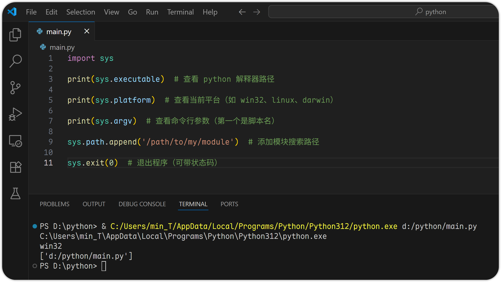

# 4 Python 函数与模块

# 函数定义与调用

## 概念与基本使用

在 Python 中，函数是组织好的、可重复使用的代码块，用于实现某个特定功能，使用函数可以提高代码的可读性、复用性和维护性。

**函数使用 def 关键字来定义，基本语法如下：**

```python
def 函数名(参数列表):
    函数体
    return 返回值
```

```python
# 定义函数
def greet(name):
    print(f"你好, {name}!")

# 调用函数
greet("小明")
greet("小红")
```


* def 关键字
* 参数顺序、默认参数、可变参数（\*args, \*\*kwargs）
* 返回值 return

## 函数参数详解

Python 支持多种类型的参数，理解它们有助于写出更灵活、更强大的函数。

### 必须参数/位置参数 (Positional Arguments)

必须按照函数定义时的顺序传入对应的参数值。

```python
def greet(name, age):
    return f"Hello, {name}! You are {age} years old."

# 正确传参
print(greet("LiSi", 18))

# 错误传参
print(greet(18, "LiSi"))
```


### 默认参数（Default Arguments）

如果调用时没有传参，则使用默认值。

```python
def greet(name="用户"):
    print(f"欢迎你, {name}!")

greet()
greet("Tom")
```


> 注意：默认参数只会在参数定义时计算一次，不要使用 `[]` 或 `{}` 这类可变对象作为默认参数。

### 可变位置参数（\*args）

接收任意数量的位置参数，打包为元组。

```python
def sum_all(*numbers):
    total = 0
    for num in numbers:
        total += num
    return print(f"所有参数 {numbers} 的总和为: {total}")

sum_all(4)
sum_all(1, 2, 3, 5)
```


### 可变关键字参数（\*\*kwargs）

接收任意数量的关键字参数，打包为字典。

```python
def user_info(**info):
    for key, value in info.items():
        print(f"{key}: {value}")

user_info(name="Alice", age=25, city="ShenZhen")
```


### 参数顺序规则

定义函数时，显然可变长度的参数不能放在最前面，

因此，参数顺序应该遵循以下规则：

```python
def func(positional, default, *args, **kwargs):
    ...
```

```python
def example(a, b=2, *args, **kwargs):
    print("a:", a)
    print("b:", b)
    print("args:", args)
    print("kwargs:", kwargs)

example(100)
print("-----------")
example(10, 20, 30, 40, name="Tom", age=30)
```


## 返回值

函数可以通过 return 返回结果，也可以不写（表示返回 None）。

```python
def multiply1(a, b):
    a + b

print(f" 4 + 5 的结果为: {multiply1(4, 5)}")


def multiply2(a, b):
    return a * b
    return a + b

print(f" 4 * 5 的结果为: {multiply2(4, 5)}")
```


# 作用域与命名空间

## 命名空间与作用域（Namespace vs Scope）

| **对比项**  | **命名空间（Namespace）**                                                                                | **作用域（Scope）**                              |
| -------- | -------------------------------------------------------------------------------------------------- | ------------------------------------------- |
| **定义**   | 一个从名称到对象的映射表，它决定了变量名和变量值之间的对应关系，是 Python 中管理变量的核心机制之一。&#xA;你可以把它想象成一本“电话簿”，每个名字（变量名）都对应着一个号码（变量值）。 | 程序中变量可以被访问的区域范围                             |
| **本质**   | 是一个“名字到对象”的映射表（如字典）                                                                                | 是一个“代码区域”，决定了哪个命名空间可见                       |
| **关注点**  | “哪些名字存在？”、“对应什么值？”                                                                                 | “这些名字在哪里能被访问？”                              |
| **生命周期** | 创建于进入作用域时，销毁于离开时                                                                                   | 控制变量何时可访问、何时不可访问                            |
| **类型**   | Built-in / Global / Enclosing / Local                                                              | Local / Enclosing / Global / Built-in（LEGB） |
| **例子**   | `locals()`、`globals()`返回当前命名空间                                                                     | 函数内部是 Local Scope，模块级别是 Global Scope        |
| **是否可见** | 不直接决定可见性                                                                                           | 直接决定变量是否可见                                  |
| **关系**   | 每个作用域都有自己的命名空间                                                                                     | 作用域决定了使用哪个命名空间                              |

```python
x = "global x"  # 定义一个全局变量 x

def func():
    x = "local x"  # 定义一个局部变量 x，与全局变量 x 同名
    print("在函数局部作用域 Local Scope 中，打印变量 x 的值:\n", x)
    print("在函数局部作用域 Local Scope 中，打印当前函数的局部命名空间 Local Namespace (包含所有局部变量及值):\n", locals()) 
    print("在函数局部作用域 Local Scope 中，打印全局命名空间 Global Namespace (包含所有全局变量及值):\n", globals())

func()  # 调用函数 func
print("-----------------")

print("在全局作用域 Global Scope 中，打印全局变量 x 的值:\n", x)
print("在全局作用域 Global Scope 中，打印全局命名空间 Global Namespace (包含所有全局变量及值):\n", globals())
print("在全局作用域 Global Scope 中，打印局部命名空间 Local Namespace (此时与 Global Namespace 相同):\n", locals())
```


## LEGB 变量查找规则

当 Python 在查找一个变量时，它会按照以下变量作用域查找规则进行顺序搜索：

`L:Local` → `E:Enclosing` → `G:Global` → `B:Built-in`

| **作用域**          | **描述**                                    |
| ---------------- | ----------------------------------------- |
| **L（Local）**     | 局部作用域，当前函数内部的变量                           |
| **E（Enclosing）** | 嵌套作用域，包含当前函数的外部函数的局部作用域                   |
| **G（Global）**    | 全局作用域，模块级别的变量                             |
| **B（Built-in）**  | 内置作用域，Python 内置的变量和函数，如 `len()`、`max()` 等 |

```python
# B: Built-in

x = "global x"  # G: Global

def outer():
    x = "enclosing x"  # E: Enclosing

    def inner():
        x = "local x"  # L: Local
        print("inner:", x)

    inner()

    print("outer:", x)

outer()

print("global:", x)

print("built-in:", len)  # 打印内置函数 len
```


## 全局变量 vs 局部变量

| **特性** | **全局变量**      | **局部变量** |
| ------ | ------------- | -------- |
| 定义位置   | 函数外部或模块层级     | 函数内部     |
| 生命周期   | 整个程序运行期间存在    | 函数调用期间存在 |
| 可见范围   | 整个模块都可以访问     | 仅限于函数内部  |
| 修改方式   | 需要使用 `global` | 直接修改即可   |
| 是否可变   | 否（除非使用关键字）    | 是        |

1. **示例一：局部变量不可在函数外部访问**
   ```python
   def func():
       y = 20
       print(y)

   func()
   print(y)
   ```
   
2. **示例二：全局变量在函数中可读，但不能直接修改，需使用 global 关键字声明**
   ```python
   count = 0

   def add1():
       global count
       print(count)
       count += 1
       print(count)

   def add2():
       print(count)
       count += 1
       print(count)

   add1()
   print("---")
   add2()
   ```
   
   ```python
   count = 0

   def add1():
       global count
       print(count)
       count += 1
       print(count)

   def add3():
       print(count)

       global count
       count += 1
       print(count)

   add1()
   print("---")
   add3()
   ```
   

## nonlocal: 嵌套函数中修改外层变量

**`nonlocal`** 关键字适用于嵌套函数中，允许你在内层函数中修改外层函数的变量，而不是创建一个新的局部变量。

```python
def outer():
    num = 10

    def inner():
        nonlocal num
        num += 5

    inner()
    print("outer num:", num)

outer()
```


## closure: 闭包 —— 外层函数返回内层函数

闭包 Closure 就是一个函数，它可以记住并访问它被创建时所在的环境（作用域），即使这个函数在它的外部被调用。

```python
def outer(x):
    def inner(y):
        return x + y
    return inner

closure = outer(10)

print(closure(10))
print(closure(15))
print(closure)   # 打印闭包函数本身
print(closure.__closure__[0].cell_contents)  # 获取闭包函数记住的值 x = 10
```


## 实战练习

1. 全局变量在模块间共享导致的错误

   场景：在一个项目中，config.py 定义了一个全局配置变量 `DEBUG = False`，多个模块导入该变量并使用它进行日志输出。
   ```python
   DEBUG = False
   ```
   ```python
   from config import DEBUG

   def log(msg):
       if DEBUG:
           print("[Module A] Debug:", msg)
       else:
           print("[Module A] INFO:", msg)
   ```
   ```python
   import config

   def log(msg):
       if config.DEBUG:
           print("[Module B] Debug:", msg)
       else:
           print("[Module B] INFO:", msg)
   ```
   ```python
   import config
   from module_a import log as a_log
   from module_b import log as b_log

   config.DEBUG = True
   a_log("Test from A")
   b_log("Test from B")
   ```
   

   Q：对照来看，为什么 module\_b 的 DEBUG 正常开启了，module\_a 并没有开呢？

   A：因为在 Python 中，`from module import var_name` 是复制引用值，并不是动态绑定了原变量，正确做法是使用 `import module_xx` + `module_xx.varName` 在所有模块中都直接访问变量，而不是复制值。
2. 闭包实现计数器工厂

   场景：你需要为多个业务模块创建独立的计数器，比如用于统计订单、用户注册等。
   ```python
   def counter_factory():
       count = 0

       def counter():
           nonlocal count  # 这里告诉 python 不要在函数中新建一个 count, 而是去上层作用域中找
           count += 1
           return count
       
       return counter

   order_counter = counter_factory()
   user_counter = counter_factory()

   print(order_counter())  # 执行完后, count = 1, 但它不会被销毁，而是保存在内存中等待闭包函数再次使用
   print(user_counter())
   print(order_counter())
   print(user_counter())
   ```
   

   上述两个计数器互不干扰，这就是经典的工厂模式的实现。可用于企业中的：
   * 实现单例状态管理
   * 数据缓存隔离
   * 订单流水号生成器
3. 多层嵌套函数 + nonlocal 使用陷阱

   场景：你在编写一个数据处理模块，有一个外层函数负责初始化上下文，中间函数做预处理，内层函数执行计算。
   ```python
   data = ["X", "Y", "Z"]

   def process_data():
       data = [1, 2, 3]

       def preprocess():
           data = ["A", "B", "C"]

           def transform():
               nonlocal data
               #global data
               data = [x.lower() for x in data]
               print("transform data:", data)

           transform()
           print("preprocess data:", data)

       preprocess()
       print("process_data data:", data)

   process_data()
   ```
   
4. 模块级变量污染问题（企业常见 bug）

   场景：你在开发一个 Flask Web 应用，使用模块级变量保存临时状态。
   ```python
   current_user = None

   def login_user(username):
       global current_user
       current_user = username

   def get_current_user():
       return current_user
   ```
   ```python
   from app import login_user, get_current_user

   login_user("Alice")
   print(get_current_user())

   login_user("Bob")
   print(get_current_user())
   ```
   

   Q：这样看起来似乎没什么问题，但这个设计只是在单线程下没问题，多线程或异步环境下会出现多个请求同时修改了全局的 `current_user`，从而导致用户状态混乱的问题。

   A：改进方案 —— 使用标准库中的线程局部变量（Thread Local Storage） 或 Flask 内置的 g 对象/session 机制。
   ```python
   import threading

   # 创建一个 threading.local 对象，用来存储线程局部变量
   thread_local = threading.local()

   def login_user(username):
       # 将传入的用户名赋值给当前线程的 thread_local 对象的 current_user 属性
       thread_local.current_user = username

   def get_current_user():
       # 使用 getattr() 来获取 thread_local 对象的 current_user 属性，如果不存在则返回 None
       return getattr(thread_local, 'current_user', None)
   ```
   ```python
   from flask import g

   def get_current_user():
       # 使用 getattr() 从 g 对象中获取 current_user 属性，没有则返回 None
       return getattr(g, 'current_user', None)

   def set_current_user(username):
       g.current_user = username
   ```
5. 大型函数重构与作用域控制

   场景：你接手一段遗留代码，其中有个大函数做了很多事，变量命名混乱，容易出错。
   ```python
   def analyze_data(data):
       result = []
       temp = []

       for d in data:
           if d > 10:
               temp.append(d * 2)
       
       for t in temp:
           result.append(t + 5)
       return result
   ```
   ```python
   def filter_data(data):
       return [d * 2 for d in data if d > 10]

   def process_data(filtered):
       return [t + 5 for t in filtered]

   def analyze_data(data):
       filtered = filter_data(data)
       return process_data(filtered)
   ```
   改造后的好处：
   * 每个函数只关注一个任务
   * 变量作用域更清晰
   * 更容易测试和复用
   * 避免命名冲突

# Lambda 表达式

## 基本概念

Lambda 函数是一种没有名字的函数，用于快速定义简单的、一次性的函数。

* 它只能包含一个表达式，不需要使用 return，结果会自动返回
* 适用于那些只需要用一次的小函数

**语法：**

```python
lamba 参数: 表达式
```

示例：

```python
# 普通函数
def square1(x):
    return x * x

# Lambda 版本
square2 = lambda x: x * x

print(square1(5))
print(square2(5))
```


> 注意：虽然 Lambda 函数可以赋值给变量名，但它的主要用途还是作为参数传递给其他函数（如 map、filter）

## 配合 map() 使用

map(func, iterable)

对可迭代对象中的每个元素应用函数 func，常与 Lambda 搭配使用。

```python
numbers = [1, 2, 3, 4, 5]

squared = list(map(lambda x: x ** 2, numbers))
print(squared)
```


## 配合 filter() 使用

filter(func, iterable)

过滤掉不满足条件的元素：func 返回 True 的元素保留，否则被过滤

```python
numbers = [1, 2, 3, 4, 5]

evens = list(filter(lambda x: x % 2 == 0, numbers))
print(evens)
```


## 实战练习

1. 将字符串列表转为大写
   ```python
   words = ['hello', 'world', 'python']

   upper_words = list(map(lambda word: word.upper(), words))
   print(upper_words)
   ```
   
2. 筛选出长度大于 3 的单词
   ```python
   words = ['hi', 'hello', 'a', 'python', 'zhangsan']

   long_words = list(filter(lambda word: len(word) > 3, words))
   print(long_words)
   ```
   
3. 对字典列表按某个键排序
   ```python
   students = [
       {'name': 'Alice', 'age': 25},
       {'name': 'Bob', 'age': 20},
       {'name': 'Charlie', 'age': 23}
   ]

   sorted_students = sorted(students, key=lambda student: student['age'])
   print(sorted_students)
   ```
   

# 模块与包

模块（Module）是一个 .py 文件，用于将代码逻辑分离，便于维护和复用。

包（Package）则是包含多个模块的目录结构，通常用于组织大型项目。

## import 导入模块

**语法：**

```python
import module_name
```


## from ... import ...

可以只导入模块中的某个函数、变量或类。

**语法：**

```python
from module_name import function_name
function_name()

# 一次性导入多个
from module_name import function1, function2
function1()
function2()

# 使用别名
from module_name import function1 as func1
func1()
```


## sys.path.append() 添加路径

当你导入模块时，Python 会在 `sys.path` 列表中查找模块，如果你的模块不在标准路径下，那么可以通过 `sys.path.append()` 添加自定义路径。

示例：

```python
import sys
import os

# 添加当前目录下的 my_modules 目录到搜索路径
sys.path.append(os.path.join(os.path.dirname(__file__), 'my_modules'))

# 然后就可以导入该目录下的模块
import my_module1
```

> 注意：`sys.path` 是运行时设置，程序重启后修改就失效。如需永久生效，请设置环境变量 `PYTHONPATH`。

## 自建模块或包（单个文件或目录结构）

### 单个模块文件

一个 .py 文件，比如前面的 utils.py。

### 包（package）

一个包含多个模块的目录，并且必须包含一个 `__init__.py` 文件（Python 3.3+ 可忽略，但建议保留）。

示例结构：

```python
my_package/
├── __init__.py
├── module_a.py
└── module_b.py
```

在其他地方导入使用：

```python
import my_package.module_a
my_package.module_a.func_a()

# 如果是包内部模块之间，可以使用相对导入
from . import module_a
```

**\_\_init\_\_.py 的作用：**

* 控制包的初始化行为
* 定义列表 `__all__` 来控制 `from package import *` 能导入哪些函数
* 可以统一暴露接口，让导入更简洁

```python
__all__ = ['basic', 'advanced']

from . import basic
from . import advanced
fomr . import limited
```

使用方导入包时：

```python
# 若指定具体的导入模块，正常工作不受影响
from mathlib import basic, advanced, limited

# 若使用 import *, 则不会包含 limited
from mathlib import *
```

> 注意：`__all__` 可以在任意 .py 中都可以定义，若在 `module_xx.py` 中定义则是控制一个普通“模块”的导入行为，而在 `__init_.py` 中定义则是控制“整个包”的导入行为。

# 常用内置模块

## os: 操作系统相关操作

用于与操作系统交互，如文件/目录操作、环境变量、进程控制等。

```python
import os

print(os.getcwd())  # 获取当前工作目录

path = os.path.join('folder', 'subfolder', 'file.txt')  # 路径拼接，跨平台很好的兼容性

os.mkdir('new_folder')  # 创建目录

print(os.listdir('.'))  # 列出指定目录（.为当前目录）下的文件和子目录

os.rmdir('new_folder')  # 删除目录

print(os.environ.get('PATH'))  # 环境变量

os.system('echo Hello from shell')  # 运行系统命令（跨平台）
```


## sys: 解释器相关操作

用于访问 Python 解释器相关的变量和函数，常用于脚本参数处理、退出程序、导入路径管理等。

```python
import sys

print(sys.executable)  # 查看 python 解释器路径

print(sys.platform)  # 查看当前平台（如 win32、linux、darwin）

print(sys.argv)  # 查看命令行参数（第一个是脚本名）

sys.path.append('/path/to/my/module')  # 添加模块搜索路径

sys.exit(0)  # 退出程序（可带状态码）
```



## math: 数学函数

提供常见的数学函数和常量。

```python
import math

# 常量
print(math.pi)
print(math.e)

# 基本函数
print(math.sqrt(6))     # 平方根
print(math.pow(2, 3))   # 幂运算
print(math.ceil(2.3))   # 向上取整
print(math.floor(2.3))  # 向下取整
print(math.sin(math.radians(90)))  # sin(90°) → 1.0
```


## random: 随机数生成

用于生成随机数，适用于游戏、模拟、测试等场景。

```python
import random

print(random.random())  # 随机浮点数

print(random.randint(1, 10))  # 随机整数 [a, b] 包括两端

print(random.choice(['apple', 'banana', 'cherry']))

# 打乱列表顺序
nums = [1, 2, 3, 4, 5]
random.shuffle(nums)
print(nums)
```


## datetime: 日期时间处理

用于处理日期和时间，支持格式化、加减、比较等操作。

```python
from datetime import datetime, timedelta

# 获取当前时间
now = datetime.now()
print(now)

# 获取指定时间
dt = datetime(2025, 7, 10, 15, 30)
print(dt)

# 时间加减
tomorrow = now + timedelta(days=1)
print(tomorrow)

# 格式化输出
print(now.strftime("%Y-%m-%d %H:%M:%S"))

# 从字符串解析时间
date_str = "2025-07-10 15:30:45"
parsed = datetime.strptime(date_str, "%Y-%m-%d %H:%M:%S")
print(parsed)
```


# 实战练习

## 每日获取并保存北京天气预报

**业务背景：**

某企业运维部门需每日凌晨自动获取北京未来天气数据，并保存为 CSV 文件供内部系统使用。

**使用模块：**

* `requests`：调用公开天气 API
* `pandas`：处理和保存数据
* `schedule`：定时任务调度
* `datetime`, `time`：时间控制

```shellscript
# 安装所需模块
pip install requests pandas schedule
```

```python
import requests
import pandas as pd
from datetime import datetime
import time
import schedule

# 北京经纬度
LATITUDE = 39.9042
LONGITUDE = 116.4074
OUTPUT_FILE = "beijing_weather_forecast.csv"

def fetch_weather_data():
    url = f"https://api.open-meteo.com/v1/forecast?latitude={LATITUDE}&longitude={LONGITUDE}&daily=weathercode,temperature_2m_max,temperature_2m_min&timezone=Asia/Shanghai"
    response = requests.get(url)
    if response.status_code == 200:
        data = response.json()
        daily = data['daily']

        df = pd.DataFrame({
            'date': daily['time'],
            'max_temp': daily['temperature_2m_max'],
            'min_temp': daily['temperature_2m_min'],
            'weather_code': daily['weathercode']
        })
        df['city'] = 'Beijing'
        df.to_csv(OUTPUT_FILE, index=False)
        print(f"[{datetime.now()}] 天气数据已更新并保存到 {OUTPUT_FILE}")
    else:
        print(f"[{datetime.now()}] 获取天气数据失败，状态码: {response.status_code}")

# 每天凌晨5点执行
schedule.every().day.at("05:00").do(fetch_weather_data)

if __name__ == "__main__":
    print("启动定时任务...")
    fetch_weather_data()  # 首次立即执行一次
    while True:
        schedule.run_pending()
        time.sleep(60)  # 每分钟检查一次
```


## 每日获取苹果公司股价数据

**业务背景：**

某金融公司需每日记录苹果公司股票收盘价和成交量，用于内部风险分析和趋势预测。

**使用模块：**

* `yfinance`: 获取 Yahoo Finance 上的股票数据
* `pandas`: 数据结构与 CSV 写入操作
* `schedule`: 定时任务调度器
* `tenacity`: 增加重试机制，应对限流
* `datetime`, `time`: 时间控制

```shellscript
pip install yfinance pandas schedule tenacity
```

```python
import yfinance as yf
import pandas as pd
from datetime import datetime
import time
import schedule
from tenacity import retry, stop_after_attempt, wait_fixed
import logging

# 配置日志
logging.basicConfig(level=logging.INFO, format='%(asctime)s - %(levelname)s - %(message)s')

OUTPUT_FILE = "aapl_stock_data.csv"

@retry(stop=stop_after_attempt(3), wait=wait_fixed(300))  # 最多尝试 3 次，每次间隔 300 秒
def fetch_stock_data():
    try:
        ticker = yf.Ticker("AAPL")
        hist = ticker.history(period="1d")

        if not hist.empty:
            df = hist.reset_index()
            df['symbol'] = "AAPL"
            file_exists = pd.io.common.file_exists(OUTPUT_FILE)
            df.to_csv(OUTPUT_FILE, mode='a', header=not file_exists, index=False)
            logging.info(f"已记录 AAPL 最新股价: ${df['Close'][0]:.2f}, 成交量: {df['Volume'][0]}")
        else:
            logging.warning("获取股票数据为空。")
    except Exception as e:
        logging.error(f"获取股票数据时发生错误: {e}")
        raise  # 触发重试机制

# 设定每天下午 4:30 执行
schedule.every().day.at("16:30").do(fetch_stock_data)

if __name__ == "__main__":
    logging.info("启动股票数据定时任务...")
    
    # 首次立即执行一次
    try:
        fetch_stock_data()
    except Exception as e:
        logging.error(f"首次执行失败: {e}")

    # 启动定时器
    while True:
        schedule.run_pending()
        time.sleep(60)  # 每分钟检查一次
```


## 每小时获取全球汇率数据（EUR 基准）

**业务背景：**

某跨境电商平台需实时掌握欧元对其他货币的汇率变化，以调整商品定价策略。

**使用模块：**

* `requests`：调用汇率 API
* `json`：处理 JSON 数据
* `schedule`：定时任务调度
* `datetime`, `time`：时间控制

```python
import requests
import json
from datetime import datetime
import time
import schedule
from tenacity import retry, stop_after_attempt, wait_fixed
import logging

# ========================
# 配置区域
# ========================

OUTPUT_FILE = "exchange_rates.json"  # 输出 JSON 文件路径
FETCH_URL = "https://api.exchangerate-api.com/v4/latest/EUR"  # 数据源
FETCH_INTERVAL = 1  # 每小时执行一次
LOG_LEVEL = logging.INFO  # 日志级别

# 配置日志系统
logging.basicConfig(
    level=LOG_LEVEL,
    format='%(asctime)s - %(levelname)s - %(message)s'
)

# ========================
# 核心函数
# ========================

@retry(stop=stop_after_attempt(3), wait=wait_fixed(60))  # 失败最多重试 3 次，每次间隔 60 秒
def fetch_exchange_rates():
    """
    获取 EUR 为基准的汇率数据，并写入 JSON 文件。
    如果失败，抛出异常后会自动重试。
    """
    try:
        logging.info("开始获取汇率数据...")
        response = requests.get(FETCH_URL, timeout=10)  # 设置超时

        if response.status_code == 200:
            data = response.json()
            rates = data.get('rates')

            if rates:
                result = {
                    "timestamp": datetime.now().isoformat(),
                    "base": data.get('base', 'UNKNOWN'),
                    "rates": rates
                }

                with open(OUTPUT_FILE, 'w', encoding='utf-8') as f:
                    json.dump(result, f, indent=2, ensure_ascii=False)

                logging.info(f"汇率数据已更新, EUR/USD: {rates.get('USD', 'N/A')}")
            else:
                logging.warning("获取到的汇率数据中缺少 'rates' 字段。")
        else:
            logging.error(f"请求失败，状态码: {response.status_code}")
            raise Exception(f"HTTP 错误: {response.status_code}")

    except requests.exceptions.RequestException as e:
        logging.error(f"网络请求出错: {e}")
        raise
    except json.JSONDecodeError as e:
        logging.error(f"JSON 解析失败: {e}")
        raise
    except Exception as e:
        logging.error(f"未知错误: {e}")
        raise

# ========================
# 主程序逻辑
# ========================

if __name__ == "__main__":
    logging.info("启动汇率监控任务...")

    try:
        fetch_exchange_rates()  # 立即执行一次
    except Exception as e:
        logging.error(f"首次获取汇率失败: {e}")

    # 设置定时任务
    schedule.every(FETCH_INTERVAL).hours.do(fetch_exchange_rates)

    logging.info(f"已设置每 {FETCH_INTERVAL} 小时获取一次汇率数据。")

    # 循环等待执行
    while True:
        schedule.run_pending()
        time.sleep(60)  # 每分钟检查一次定时任务
```


